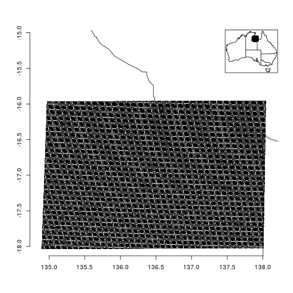
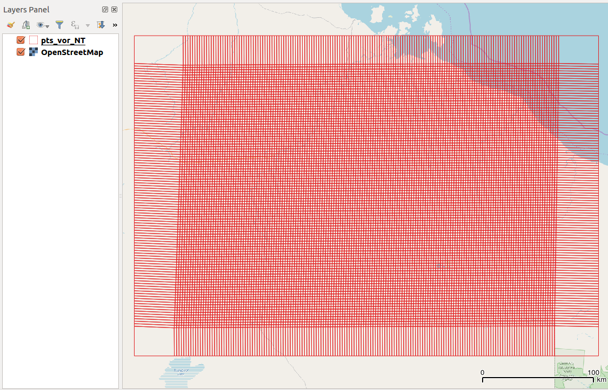
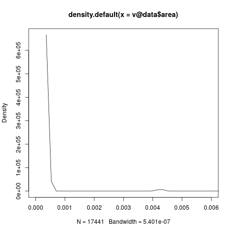
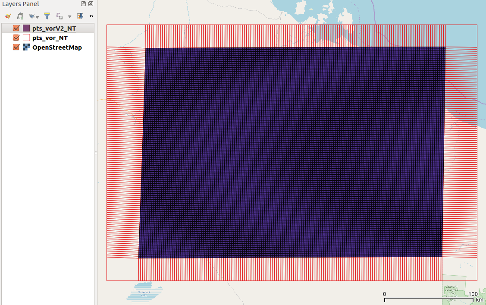
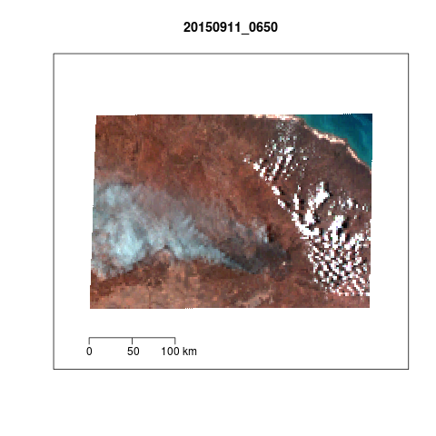

--- 
title: "A dataset for training a predictive model to identify bushfire smoke plumes from satellite images."
author: "Hanigan I.C., Williamson G.W., Larsen A., Horsley, J., Qin Y., Cope M., Rappold, A., Morgan G.G."
date: "Draft `r Sys.Date()`"
site: bookdown::bookdown_site
output: bookdown::gitbook
---

*Abstract:*

We describe the data we prepared as a training dataset of bushfire smoke and fire hotspots data for a machine learning project to classify satellite image pixels as bushfire smoke. R codes and sample data files are described and shared. The prospect for future users of the data is enhanced by the description in this paper, and the availability of these data on the open access Github repository.

*Keywords:* wildfire; smoke; cloud, dust; remote sensing

# Introduction

# Advanced Himawari Imager (AHI) atmospheric optical depth (AOD) and cloud mask data

We used the processed cloud mask data derived from the satellite imagery of the Advanced Himawari Imager (AHI) data created by Qin et al. (2019). The AHI instrument is onboard the Himawari-8 satellite. The Himawari-8 records true colour imagery at 0.5 to 2 km resolution, which are averaged to 2 km by Qin et al., in 10-minute intervals. We downloaded the netCDF files available from https://hpc.csiro.au/users/254864/ML_smoke/.  TODO Do we need a reference for where the original Himawari data were downloaded from by Yi.

The first step was to extract the latitude and longitude data from the netCDF file as follows:


```{r, eval = F, echo = T}

#### Step 1: Set up ####
projdir <- "/home/ivan_hanigan/Dropbox/projects/air_pollution_ucrh/Smoke_plumes_in_satellite_imagery_JFSP/Smoke_plume_hotspots_ML_JFSP/manuscript/Appendix"
setwd(projdir)
# set scope
stdyreg <- "NT"  
year_i <- 2015

# func
library(ncdf4)
library(rgdal)
library(maps)
library(reshape)
library(raster)
library(data.table)
library(dplyr)

#### Step 1.2.1: load AHI cloud mask locations ####
indir_ahi <- "data_provided"
infile_ahi <- dir(indir_ahi, pattern = "invariable")
infile_ahi
locs <- nc_open(file.path(indir_ahi, infile_ahi))
lats1    <- ncvar_get(locs, varid = "latitude")
lons1    <- ncvar_get(locs, varid = "longitude")
nc_close(locs)
## visualise
plotdf <- data.frame("lons" = melt(lons1)$value, "lats" = melt(lats1)$value)
png("figs/qc_locs.png")
library(oz)
m <- matrix(c(1,1,2,1),2,2)
layout(m, widths=c(2, 1),heights=c(1.2, 2))
#layout.show(2)
## map("world", regions = "Australia", xlim = c(130, 140), ylim = c(-20, -9))
oz(ylim = c(range(plotdf$lats)[1]-.1, range(plotdf$lats)[2]+1), xlim = c(range(plotdf$lons)[1]-.1, range(plotdf$lons)[2]+.1))
with(plotdf, points(lons, lats, cex = 0.5, pch = 16))
axis(1); axis(2)
oz()
box()
with(plotdf, points(lons, lats))
dev.off()

# for future processing we need to recall the width and height 
h <- dim(lats1)[1]
w <- dim(lons1)[2]

```

The points are the centre of each pixel. These pixels are on a section of the image disc that is distorted and so the pixels are not squares in the geographical coordinate system. The shape in the figure \@ref(fig:nt-casestdy-raw) is therefore not a rectangle.

```{r, nt-casestdy-raw, echo = F, fig.cap = "NT case study AHI points"}

```

```{r, eval = F}

#### Step 1.2.2: create voronoi ####
## we cannot transform the point data layer into a raster. so use voronoi instead
## only do this once
do_voronoi <- FALSE
if(do_voronoi){
## install.packages("deldir", dependencies=TRUE)
library(deldir)
## install.packages("SDraw")
library(SDraw)
plotdf$gid <- 1:nrow(plotdf)
pts <- SpatialPointsDataFrame(coords = plotdf[,1:2], data = plotdf, proj4string = CRS("+proj=longlat +datum=WGS84 +ellps=WGS84 +towgs84=0,0,0"))
v <- voronoi.polygons(pts)
v@data <- cbind(v@data, plotdf)
head(v@data)
names(v@data) <- c("eastings", "northings", "area", "x", "y", "gid")
writeOGR(v, "working_temporary", sprintf("pts_vor_%s", stdyreg), driver = "ESRI Shapefile", overwrite_layer = T)
## visualise in QGIS
png("figs/qc_voronoi_raw_density.png")
## there are some voronoi on the outer ring that have very large
## areas, to accomodate the distortion
plot(density(v@data$area), xlim = c(0, 0.006))
dev.off()

## we will only use the internal voronoi (exclude large polygons)
writeOGR(v[v@data$area < 0.004,], "data_provided", sprintf("pts_vorV2_%s", stdyreg), driver = "ESRI Shapefile", overwrite_layer = T)
}
## if we are not recreating this then just load it
indir_stdyreg <- "data_provided"
dir(indir_stdyreg)
infiles_stdyreg <- sprintf("pts_vorV2_%s", toupper(stdyreg))
r_stdyreg <- readOGR(indir_stdyreg, infiles_stdyreg)
## plot(r_stdyreg)

## now we have reduced the width and heigh by two
## because the voronoi have excluded edge polygons
## so subtract two from h and w, which we use later to index the cells
h <- h-2; h
w <- w-2; w
h*w

```

As the pixels are distorted we created Voronoi polygons which can accomodate this.
We used the `voronoi.polygons` function from the R package `SDraw` which is a convenience routine for the `deldir` function in the R package of the same name.

Trent McDonald and Aidan McDonald (2019). SDraw: Spatially Balanced Samples of Spatial Objects. R package version 2.1.8. https://CRAN.R-project.org/package=SDraw

Rolf Turner (2014). deldir: Delaunay Triangulation and Dirichlet (Voronoi) Tessellation.. R package version 0.1-7. https://CRAN.R-project.org/package=deldir


The figure \@ref(fig:nt-vor-raw) shows this result.

```{r, nt-vor-raw, echo = F, fig.cap = "NT case study Voronoi around AHI points"}

```

A side effect of this function is that the edge polygons are too large, and so we restrict this based on size. Figure \@ref(fig:nt-vor-dens) shows the distribution of sizes, and we chose 0.004 square decimal degrees as the upper limit.
 
```{r, nt-vor-dens, echo = F, fig.cap = "NT case study Voronoi sizes"}

```

The resultant set of voronoi polygons is shown in figure \@ref(fig:nt-vorV2)

```{r, nt-vorV2, echo = F, fig.cap = "NT case study Voronoi final set"}

```

TODO: zoom in on one of the vornoi polygons, and cite the software used to interpolate.

```{r, eval = F}

#### Step 2.1: list AHI files available ####

flist_ahi_cloud_mask <- dir(indir_ahi, pattern = ".nc$", recursive = T, full.names = T)
head(basename(flist_ahi_cloud_mask))
invar_to_remove <- grep("invariable", basename(flist_ahi_cloud_mask))
basename(flist_ahi_cloud_mask)[invar_to_remove]
datetimes <- matrix(unlist(strsplit(basename(flist_ahi_cloud_mask)[-invar_to_remove], "_")), ncol = 7, byrow=TRUE)[,4:5]
unique(datetimes[,2])

```

# Recodes for missing, cloud, and AOD threshold

The R code below is showing the computations for a single iteration of the loop (the full loop runs over all timepoints).

```{r, echo = T, eval = F}
#### Step 2.3 start loop over dates ####
my_date <-  "20150911_0650"
## The cloud mask data is more valid at greater values of OD 
## we set this up as a threshold of 0.5 to start with but intend to check sensitivity to this
od_threshold <- 0.5

#### Step 2.4: cloud mask and AOD data ####
flnm <- flist_ahi_cloud_mask[grep(my_date, flist_ahi_cloud_mask)]
print(basename(flnm))

## read in the data
ncin <- nc_open(flnm)
names(ncin$var)

## [1] "OD"       "flags"    "type"     "rtoa_b1"  "rtoa_b2"  "rtoa_b3"  "rtoa_b4" "rtoa_b5"  "tmpr_b14"
## The cloud mask data is the 'type' variable
## from the metadata we know the value labels are
## unsigned byte type[pixels,lines]   (Contiguous storage)  
# _FillValue: 0
# desc: cloud type
# types: 
#   type_code    type_name
# 10           cirrus_-20
# 11           cirrus_-50
# 12           cirrus_-50_small
# 13           cumulus_cont_clean
# 14           cumulus_cont_poll
# 15           cumulus_maritime
# 16           fog
# 17           stratus_cont
# 18           stratus_maritime
# 100          smoke(fresh)        
# 101          smoke(aged)        
# 102          dust               
# 103          absorptive         
# 110          bright smoke(fresh)
# 111          bright smoke(aged) 
# 113          bright absorptive  
# Also note that in an Email from Yi to Ivan 2018-08-08: the types 23, 27 and 33, 37 are new smoke types used to capture smoke in NSW/VIC/TAS

## we start by extracting the key layers
type <- ncvar_get(ncin, varid = "type")
od <- ncvar_get(ncin, varid = "OD")

## This section deals with coding missing / valid data (we are
## interested in whether there is any aerosol vs clear sky)
table(od, useNA = "always")
## there are 3846 NAs
min(od[!is.na(od)])
## there are no zeros
## Note that python and other tools (panoply) read this _FillValue: 0
## as zero however R reads the _FillValue as NA (but should be zero)
## so we set this
od[is.na(od)] <- 0
# now we apply the scaling 
od_attr <- ncatt_get(ncin, varid = "OD")
od <- od * od_attr$scaling

## now we want to use the "flags" value to indicated invalid/missing; or clouds
flags0 <- ncvar_get(ncin, varid = "flags")
table(flags0, useNA = "always")
## there are no NAs in this timepoint
## but if there were any, recall that R sees NAs where other software
## sees fillValue as 0s meaning no data, so just be careful and set this
flags0[is.na(flags0)] <- 0

## Now we use the flags variable to classify pixels
## this is a bitwise data mask and so we need to use the bitwAnd operator
## so we make a new matrix to put data in
flags <- flags0
## the first bit represents valid/invalid, 
## and so isolate the first bit
flags[,] <- bitwAnd(flags0, 1)
table(flags, useNA= "always") 
## there are 17434 "0s" and 7 "1s" on the 20150911_0650 timepoint 
## we can use this to indiciate which pixels are valid
## but first, because it is 0 = valid, we flip it around so 1 is valid, 0 is invalid
flags2 <- ifelse(flags == 0, 1, NA)

## now only keep type if OD is greater than threshold (we leave the
## originals in case future users want to adjust that option)
table(type, useNA = "always")
## 7 NAs
## But these are shown as zero in python, which means unclassified/invalid. 
z2 <- type * (od > od_threshold)

## sanity check: what happens where
110 * (0.51 > od_threshold)
##110
110 * (0.49 > od_threshold)
##0
110 * (NA > od_threshold)
##NA
table(z2, useNA = "always")
## TODO: we need to ask questions about the nature of OD below 0.5.
## e.g. does this imply clear sky or would it mean that the type
## cannot be determined, yet we cannot assume it necessarily means
## clear sky...

# and finally apply the flags (1 or NA)
table(flags2, useNA = "always")
z2 <- z2 * flags2
data.frame(table(z2, useNA = "always"))

## now we assess the second bit, which is cloud
flags_cl <- flags0[,]
flags_cl[,] <- bitwAnd(flags0, 2)
table(flags_cl, useNA = "always")
## this shows there are 14000 "0s" and 3441 "2s" on 20150911_0650
## TODO: we ask the question if 'type' in these pixels should be over-ruled by cloud flag

## sometimes there is missing columns in the ncdf files, so we test
## this 
if(length(names(ncin$var)) == 9){
  ## If it is 9 variables it is OK
  rtoa_b1      <- ncvar_get(ncin, varid = "rtoa_b1")
  rtoa_b1_attr <- ncatt_get(ncin, varid = "rtoa_b1")
  rtoa_b1_scaled <- rtoa_b1 * rtoa_b1_attr$scaling
  b1 <- rtoa_b1_scaled
  
  rtoa_b2      <- ncvar_get(ncin, varid = "rtoa_b2")
  rtoa_b2_attr <- ncatt_get(ncin, varid = "rtoa_b2")
  rtoa_b2_scaled <- rtoa_b2 * rtoa_b2_attr$scaling
  b2 <- rtoa_b2_scaled
  
  rtoa_b3      <- ncvar_get(ncin, varid = "rtoa_b3")
  rtoa_b3_attr <- ncatt_get(ncin, varid = "rtoa_b3")
  rtoa_b3_scaled <- rtoa_b3 * rtoa_b3_attr$scaling
  b3 <- rtoa_b3_scaled
  
  rtoa_b4      <- ncvar_get(ncin, varid = "rtoa_b4")
  rtoa_b4_attr <- ncatt_get(ncin, varid = "rtoa_b4")
  rtoa_b4_scaled <- rtoa_b4 * rtoa_b4_attr$scaling
  b4 <- rtoa_b4_scaled
  
  rtoa_b5      <- ncvar_get(ncin, varid = "rtoa_b5")
  rtoa_b5_attr <- ncatt_get(ncin, varid = "rtoa_b5")
  rtoa_b5_scaled <- rtoa_b5 * rtoa_b5_attr$scaling
  b5 <- rtoa_b5_scaled
  
  tmpr_b14      <- ncvar_get(ncin, varid = "tmpr_b14")
  tmpr_b14_attr <- ncatt_get(ncin, varid = "tmpr_b14")
  tmpr_b14_scaled <- tmpr_b14 * tmpr_b14_attr$scaling
  tmpr_b14 <- tmpr_b14_scaled
} else {
## but if it is not 9 variables we will set it to NA    
  b1 <- z2
  b1[,] <- NA
  b2 <- b1
  b3 <- b1
  b4 <- b1
  b5 <- b1
  tmpr_b14 <- b1
}

## now stitch it all together into a data frame
ahi_df<- data.frame(x = melt(lons1)$value,
                    y = melt(lats1)$value,
                    CLOUD_MASK_TYPE = melt(type)$value,
                    FLAGS_VALID = melt(flags)$value,
                    FLAGS_CLOUD = melt(flags_cl)$value,
                    CLOUD_MASK_TYPE_VALID = melt(z2)$value,
                    OD = melt(od)$value,
                    B1 = melt(b1)$value,
                    B2 = melt(b2)$value,
                    B3 = melt(b3)$value,
                    B4 = melt(b4)$value,
                    B5 = melt(b5)$value,
                    TMPR_B14 = melt(tmpr_b14)$value)
## Now add a primary key (it is very important to match this to the ID
## set in the voronoi creation step, recall we set gid as a counter on
## 1:nrow of the original netcdf lat/lons, so this is the same here)
ahi_df$gid <- 1:nrow(ahi_df)
str(ahi_df)
ahi_df$TIMEPOINT <- my_date
## finally close the netcdf file connection
nc_close(ncin)
```

```{r, echo = F, eval = F}

#### make true colour image RGB ####
## the values in the r, g and b bands need to be stretched to range 0-255
strtch <- function(x1, newmin, newmax){
  max2 <- newmax
  min2 <- newmin
  max1 <- max(x1)
  min1 <- min(x1)
  x2 <- (((x1 - min1)*(max2-min2))/(max1-min1))+min2
}

## make a plotting function
my_plot <- function(
                    df = ahi_df
                    ,
  day_i = "20150911_0650" 
  ,
  nudgex = .25
  , 
  nudgey = .25
  ,
  use_points = T
){
  
    df2 <- left_join(df[df$TIMEPOINT == day_i,], r_stdyreg@data[,c("gid", "area")], by = c("gid" = "gid"))
     str(df2)
    ## summary(df2)
    ## when there are very bright pixels we want to limit them to a
    ## lower threshold, say 97th centile
    qnt <- 0.97
    df3 <- df2[complete.cases(df2[,c("x","y","B1","B2","B3")]),]         
    ##plot(density(df3$B3))    
    df3$B3 <- ifelse(df3$B3 > quantile(df3$B3, qnt), quantile(df3$B3, qnt), df3$B3)
    #plot(density(df3$B2))
    df3$B2 <- ifelse(df3$B2 > quantile(df3$B2, qnt), quantile(df3$B2, qnt), df3$B2)
    ##plot(density(df3$B1))
    df3$B1 <- ifelse(df3$B1 > quantile(df3$B1, qnt), quantile(df3$B1, qnt), df3$B1)
    ## if there is any data then use the stretch function, if not set
    ## all pixels to a blue colour to denote missing
    if(nrow(df3)!=0){
      df3$r <- strtch(df3$B3, 0, 255)
      df3$g <- strtch(df3$B2, 0, 255)
      df3$b <- strtch(df3$B1, 0, 255)
    } else {
      df3 <- df2
      df3$r <- 0
      df3$g <- 0
      df3$b <- 255
      df3 <- df3[complete.cases(df3[,c("x","y","r","g","b")]),] 
    }
    #head(df3)
    ##map("world", )
    #use_points <- F
    if(use_points){
    with(df3,plot(x,y,col = rgb(r,g,b, maxColorValue = 255), pch = 15,
                  xlim = c(r_stdyreg@bbox[1,1]-nudgex, r_stdyreg@bbox[1,2]+nudgex),  
                  ylim = c(r_stdyreg@bbox[2,1]-nudgey, r_stdyreg@bbox[2,2]+nudgey), 
                  mar = c(4,4,4,0), axes = F, xlab = "", ylab = ""
                  ))

    } else {
    df4 <- r_stdyreg
    str(df4@data)
    str(df3)
    df4@data <- merge(df4@data, df3, by.x = "gid", by.y = "gid")
    plot(df4, col = rgb(df4$r,df4$g,df4$b, maxColorValue = 255), border = F,
                  xlim = c(r_stdyreg@bbox[1,1]-nudgex, r_stdyreg@bbox[1,2]+nudgex),  
                  ylim = c(r_stdyreg@bbox[2,1]-nudgey, r_stdyreg@bbox[2,2]+nudgey), 
         mar = c(4,4,4,0))
    }
    box()
    map.scale(ratio = F)
}
str(ahi_df)
png("figs/qc_ncdf_raw.png")
my_plot(df=ahi_df, day_i="20150911_0650", nudgex=.25, nudgey=.25, use_points=F)
title(my_date)
dev.off()

```

Figure \@ref(fig:nt-ncdf-raw) shows the true colour image based on the voronoi polygons.

```{r, nt-ncdf-raw, echo = F, fig.cap = "NT case study AHI cloud mask data (on voronoi)"}

```

```{r, eval = F}

```

# NASA Fire Hotspots

We used fire hotspots data from the NASA Visible Infrared Imaging Radiometer Suite (VIIRS) I-Band 375 m fire activity data (https://firms.modaps.eosdis.nasa.gov/download).
We added the hotspots data to the AHI cloud mask and AOD data by intersecting the points shapefile with the voronoi polygons, and average the Fire Radiative Power FRP values to summarise fire in the pixel.

```{r, eval = F, echo = T}
#### load study region bounding box ####
## this is needed to subset the national fire hotspots layer
datadir <- "data_provided"
stdyreg_bb <- readOGR(datadir, sprintf("%s-bounding-box", tolower(stdyreg)))
stdyreg_bb@bbox

#### Step 3.2: load hotspots ####
## this does all dates in the 6-mo period, so cut this down to the
## small region
do_hotspots <- FALSE
if(do_hotspots){
indir_nasa <- "/home/ivan_hanigan/projects"
indir_htspt <- file.path(indir_nasa, "NASA_FIRMS_FIRE_AND_SMOKE/NASA_FIRMS_2015_Jul_Dec_Aust/data_provided")
dir(indir_htspt)
infile_htspt <- "fire_archive_V1_37967"
hotspots <- readOGR(indir_htspt, infile_htspt)

#### subset to case study ####
htspt2 <- sp::over(hotspots, stdyreg_bb)
str(htspt2)
#plot(hotspots)
htspt3 <- hotspots
htspt3@data <- cbind(hotspots@data, htspt2)
htspt3 <- htspt3[!is.na(htspt3@data$e),]
##plot(htspt3, col = "red", add = T)
writeOGR(htspt3, "data_provided", "htspt3", driver = "ESRI Shapefile", overwrite_layer = T)
} else {
    htspt3 <- readOGR("data_provided/htspt3.shp")
}
str(htspt3@data)
htspt3@data$ACQ_DATEV2 <- as.Date(as.character(htspt3@data$ACQ_DATE))

dates_i <- names(table(htspt3@data$ACQ_DATEV2))
dates_i

names(table(htspt3@data$ACQ_TIME))
## this is UTC
## AHI cloud mask data is 10 minute intervals, so truncate the time
htspt3@data$ACQ_TIMEV2 <- sprintf("%s0", substr(as.character(htspt3@data$ACQ_TIME), 1, 3))
# this quick hack to round up or down
htspt3@data$ACQ_DATEV3 <- paste(gsub("-","",htspt3@data$ACQ_DATEV2),htspt3@data$ACQ_TIMEV2,  sep = "_")
head(htspt3@data[htspt3@data$ACQ_DATE == "2015/09/12",c("ACQ_DATEV2", "ACQ_DATE", "ACQ_TIME", "ACQ_TIMEV2", "ACQ_DATEV3")])
str(htspt3@data)
# get all hotspots on that day
hotspot_my_date <- htspt3[substr(htspt3@data$ACQ_DATEV3,1,8) == substr(my_date,1,8),]
#str(hotspot_my_date@data)
#table(hotspot_my_date@data$ACQ_DATEV3)
if(nrow(hotspot_my_date@data) != 0){
  e_HS <- extract(r_stdyreg, hotspot_my_date)
  #head(e_HS)
  e_HSv2 <- cbind(hotspot_my_date@data[,c("ACQ_TIME", "INSTRUMENT", "CONFIDENCE", "FRP")], e_HS)
  names(e_HSv2)[ncol(e_HSv2)] <- "AHI_ID"
  #head(e_HSv2)
  setDT(e_HSv2)
  e_HSv3 <- e_HSv2[,.(FRP = mean(FRP)), AHI_ID]
  #head(e_HSv3)
} else {
  e_HSv3 <- r_stdyreg@data
  #names(e_HSv3)
  names(e_HSv3)[ncol(e_HSv3)] <- "AHI_ID"
  e_HSv3 <- e_HSv3[,c("AHI_ID", "area")]
}
```

```{r, eval = F}
#### Step 4: Merge inputs ####
##head(ahi_df)
names(ahi_df) <- gsub("gid", "AHI_ID", names(ahi_df))

ahi_lc_and_htspt <- left_join(ahi_df, e_HSv3, by = "AHI_ID")
ahi_lc_and_htspt$TIMEPOINT <- my_date
head(ahi_lc_and_htspt)
# to save space remove superfluous cols
ahi_lc_and_htspt$x <- NULL
ahi_lc_and_htspt$y <- NULL
save(list = ls(), file = "workspace_for_plots.RData")

#### make true colour image 
load(file = "workspace_for_plots.RData")
#### RGB ####
strtch <- function(x1, newmin, newmax){
  max2 <- newmax
  min2 <- newmin
  max1 <- max(x1)
  min1 <- min(x1)
  x2 <- (((x1 - min1)*(max2-min2))/(max1-min1))+min2
}
#### visualise "20150911_0650" or "20150911_0010" #### 
qc <- ahi_lc_and_htspt
my_plot <- function(
  day_i = "20150911_0650" 
  ,
  nudgex = .25
  , 
  nudgey = .25
  ,
  show_smoke = T, use_points = T, clouds_from_flag = T
){
  
#  if(nrow(qc[qc$TIMEPOINT == my_dates[day_i],])>0){
    qc2 <- left_join(qc[qc$TIMEPOINT == day_i,], r_stdyreg@data, by = c("AHI_ID" = "gid"))
    #str(qc2)
    ##summary(qc2)
    qnt <- 0.97
    qc3 <- qc2[complete.cases(qc2[,c("x","y","B1","B2","B3")]),]         
    ##plot(density(qc3$B3))    
    qc3$B3 <- ifelse(qc3$B3 > quantile(qc3$B3, qnt), quantile(qc3$B3, qnt), qc3$B3)
    #plot(density(qc3$B2))
    qc3$B2 <- ifelse(qc3$B2 > quantile(qc3$B2, qnt), quantile(qc3$B2, qnt), qc3$B2)
    ##plot(density(qc3$B1))
    qc3$B1 <- ifelse(qc3$B1 > quantile(qc3$B1, qnt), quantile(qc3$B1, qnt), qc3$B1)

    

    if(nrow(qc3)!=0){
      qc3$r <- strtch(qc3$B3, 0, 255)
      qc3$g <- strtch(qc3$B2, 0, 255)
      qc3$b <- strtch(qc3$B1, 0, 255)
    } else {
      qc3 <- qc2
      qc3$r <- 0
      qc3$g <- 0
      qc3$b <- 255
      qc3 <- qc3[complete.cases(qc3[,c("x","y","r","g","b")]),] 
    }
    #head(qc3)
    ##map("world", )
    #use_points <- F
    if(use_points){
    with(qc3,plot(x,y,col = rgb(r,g,b, maxColorValue = 255), pch = 15,
                  xlim = c(r_stdyreg@bbox[1,1]-nudgex, r_stdyreg@bbox[1,2]+nudgex),  
                  ylim = c(r_stdyreg@bbox[2,1]-nudgey, r_stdyreg@bbox[2,2]+nudgey), 
                  mar = c(4,4,4,0), axes = F, xlab = "", ylab = ""
                  ))

    } else {
    qc4 <- r_stdyreg
    str(qc4@data)
    str(qc3)
    qc4@data <- merge(qc4@data, qc3, by.x = "gid", by.y = "AHI_ID")
    plot(qc4, col = rgb(qc4$r,qc4$g,qc4$b, maxColorValue = 255), border = F,
                  xlim = c(r_stdyreg@bbox[1,1]-nudgex, r_stdyreg@bbox[1,2]+nudgex),  
                  ylim = c(r_stdyreg@bbox[2,1]-nudgey, r_stdyreg@bbox[2,2]+nudgey), 
         mar = c(4,4,4,0))
    }
    box()
    library(maps)
    map.scale(ratio = F)
    # , xlim = c(134.5, 138.5), ylim = c(-19, -15)
    #     xlim = c(134.5, 138.5), ylim = c(-43.18433, -35.83812))
    #map("world", add = T, col = 'lightgrey')
    #axis(1); axis(2)
    x <- day_i #strsplit(my_dates[day_i], "_")[[1]][1]
    y <- substr(x, 1,4)
    m <- substr(x, 5,6)
    d <- substr(x, 7,8)
    t <- strsplit(day_i, "_")[[1]][2]
    h <- substr(t, 1, 2)
    mn <- substr(t, 3, 4)
    as.POSIXct(sprintf("%s-%s-%s %s:%s", y, m, d, h, mn))
    utcdate <- as.POSIXct(sprintf("%s-%s-%s %s:%s", y, m, d, h, mn))
    localdate <- as.character(utcdate + (60*60*9.5))
    title(sprintf("Time in UTC = %s", day_i),sub = sprintf("Local time ACST/UTC+9:30 = %s", localdate))

if(show_smoke){
with(qc3[qc3$FRP > 0,],
    points(x, y, cex = .7, pch = 15, col = 'red')
)

with(qc3[qc3$CLOUD_MASK_TYPE_VALID %in% c( 101, 111, 23, 27, 33, 37 ),],
    points(x, y, cex = .7, pch = 15, col = 'black')
)

with(qc3[qc3$CLOUD_MASK_TYPE_VALID %in% c( 100, 110 ),],
    points(x, y, cex = .7, pch = 15, col = 'darkgrey')
)

## TODO there is an open question about how to determine cloud either with 'flag'
if(clouds_from_flag){
## select those that are cloud, and not smoke
with(qc3[qc3$FLAGS_CLOUD != 0 & 
         !(qc3$CLOUD_MASK_TYPE_VALID %in% c( 101, 111, 23, 27, 33, 37 , 100, 110)),],
    points(x, y, cex = .7, pch = 15, col = 'green')
)
} else {
## or ignore the flags and look at type
with(qc3[qc3$CLOUD_MASK_TYPE_VALID %in% c( 10, 11, 12, 13, 14, 15, 16, 17, 18 ),],
         points(x, y, cex = .7, pch = 15, col = 'green')
)
}
## now do the missing data (NA)
with(qc3[is.na(qc3$CLOUD_MASK_TYPE_VALID),],
    points(x, y, cex = .7, pch = 15, col = 'blue')
)


      legend("topleft", legend = c("htspt", "smk1", "smk2", "NA", "cloud"), pch = rep(16,4), col = c("red", "black", "darkgrey", "blue", "green"), cex = 0.6)
      

  }
}

qc <- ahi_lc_and_htspt
##which(my_dates %in% "20150911_0650")
my_date
png("figs/plot_true_colour.png", height = 1600, width = 1250, res = 150)
par(mfrow = c(2,1))
my_plot(day_i = my_date,  
        nudgex = .25
        , 
        nudgey = .25, show_smoke = F, use_points = F)
my_plot(day_i = my_date,  
        nudgex = .25
        , 
        nudgey = .25, show_smoke = T, use_points = F, clouds_from_flag = F)
dev.off()

png("figs/plot_true_colour_clouds_yi.png", height = 1600, width = 1250, res = 150)
par(mfrow = c(2,1))
my_plot(day_i = my_date,  
        nudgex = .25
        , 
        nudgey = .25, show_smoke = F, use_points = F)
my_plot(day_i = my_date,  
        nudgex = .25
        , 
        nudgey = .25, show_smoke = T, use_points = F, clouds_from_flag = F)
dev.off()

```

# Landcover

TODO

# Major roads

TODO

# Digital Elevation Model

TODO

# Acknowledgments

Funding for this paper came from the Joint Fire Smoke Project.

# References

1. Qin, Y., Steven, A.D.L., Schroeder, T., Mcvicar, T.R. & Huang, J. (2019). Cloud Cover in the Australian Region: Development and Validation of a Cloud Masking, Classification and Optical Depth Retrieval Algorithm for the Advanced Himawari Imager. 7(February),: 1–21.
